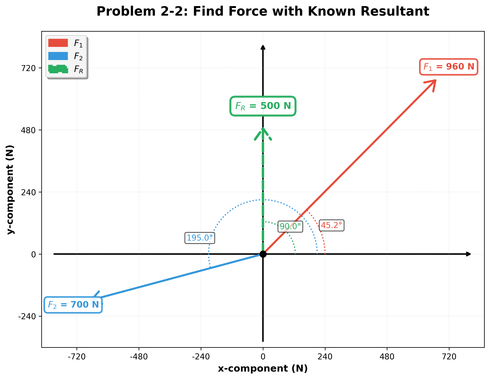

# Engineering Calculation Report: Problem 2-2: Find Force with Known Resultant

**Generated:** 2025-10-14 15:48:20

**Description:** 
    If the resultant force is to be 500 N directed along the positive y-axis,
    and F_2 = 700 N at 195°, determine the magnitude and direction of F_1.
    

## 1. Known Variables

| Symbol | Name | Value | Unit |
|--------|------|-------|------|
| F_1_mag | F_1 Magnitude | 959.778 | N |
| F_1_angle | F_1 Direction | 45.2121 | ° |
| F_2_mag | F_2 Magnitude | 700 | N |
| F_2_angle | F_2 Direction | -165 | ° |

## 2. Unknown Variables (To Calculate)

| Symbol | Name | Unit |
|--------|------|------|
| F_1_x | F_1 X-Component | N |
| F_1_y | F_1 Y-Component | N |
| F_2_x | F_2 X-Component | N |
| F_2_y | F_2 Y-Component | N |
| F_R_mag | F_R Magnitude | N |
| F_R_angle | F_R Direction | ° |
| F_R_x | F_R X-Component | N |
| F_R_y | F_R Y-Component | N |

## 3. Equations Used

1. `F_1^2 = F_R^2 + F_2^2 - 2*F_R*F_2*cos(gamma)`
2. `sin(alpha) / F_2 = sin(gamma) / F_1`

## 4. Step-by-Step Solution

### Step 1: Solve for F_1 Magnitude

    **Equation:**
    ```
    F_1^2 = F_R^2 + F_2^2 - 2*F_R*F_2*cos(gamma)
    ```

    **Substitution:**
    ```
    F_1^2 = (500.00 N)^2 + (700.00 N)^2 - 2 * (500.00 N) * (700.00 N) * cos(105.0°)
    ```

    **Result:**
    ```
    F_1 Magnitude = 959.78 N
    ```

### Step 2: Solve for F_1 Direction

    **Equation:**
    ```
    sin(alpha) / F_2 = sin(gamma) / F_1
    ```

    **Substitution:**
    ```
    sin(alpha) / 700.00 N = sin(105.0°) / 959.78 N
    ```

    **Result:**
    ```
    F_1 Direction = 45.21 °
    ```

## 5. Summary of Results

| Variable | Name | Final Value | Unit |
|----------|------|-------------|------|
| F_1_x | F_1 X-Component | 676.148 | N |
| F_1_y | F_1 Y-Component | 681.173 | N |
| F_2_x | F_2 X-Component | -676.148 | N |
| F_2_y | F_2 Y-Component | -181.173 | N |
| F_R_mag | F_R Magnitude | 500 | N |
| F_R_angle | F_R Direction | 1.5708 | ° |
| F_R_x | F_R X-Component | 3.06162e-14 | N |
| F_R_y | F_R Y-Component | 500 | N |

## 6. Vector Diagram



*Figure: Vector diagram showing all forces and their orientations*


---

## Disclaimer

While every effort has been made to ensure the accuracy and reliability of the calculations provided, we do not guarantee that the information is complete, up-to-date, or suitable for any specific purpose. Users must independently verify the results and assume full responsibility for any decisions or actions taken based on its output. Use of this calculator is entirely at your own risk, and we expressly disclaim any liability for errors or omissions in the information provided.

**Report Details:**
- **Generated Date:** October 14, 2025
- **Generated Using:** Qnty Library
- **Version:** Beta (Independent verification required for production use)

**Signatures:**

| Role | Name | Signature | Date |
|------|------|-----------|------|
| Calculated By | _________________ | _________________ | _______ |
| Reviewed By | _________________ | _________________ | _______ |
| Approved By | _________________ | _________________ | _______ |

*Report generated using qnty library*