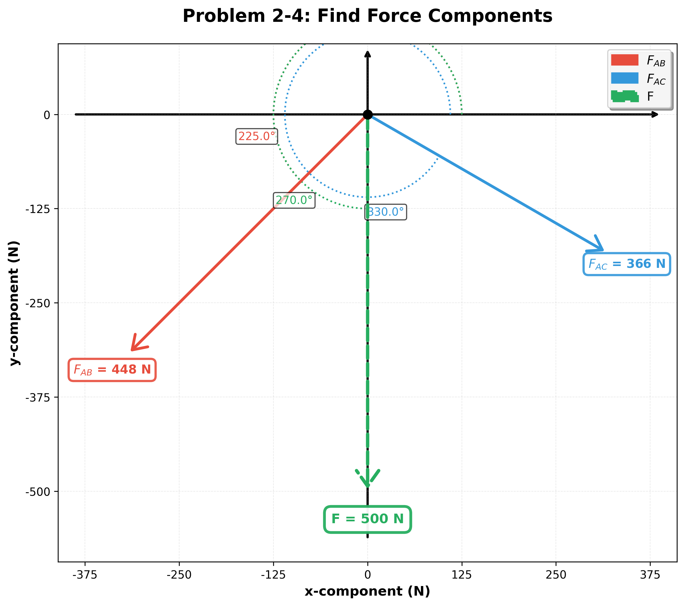

# Engineering Calculation Report: Problem 2-4: Find Force Components

**Generated:** 2025-10-14 16:51:50

**Description:** 
    The vertical force F acts downward at A on the two-membered frame.
    Determine the magnitudes of the two components of F directed along the axes of AB and AC.
    Set F = 500 N.
    

## 1. Known Variables

| Symbol | Magnitude (unit) | Angle (°) |
|--------|------------------|-----------|
| F | 500 N | -90 |

## 2. Unknown Variables (To Calculate)

| Symbol | Magnitude (unit) | Angle (°) |
|--------|------------------|-----------|
| F_AB | ? N | 225 |
| F_AC | ? N | 330 |

## 3. Equations Used

## 4. Step-by-Step Solution

*No detailed solution steps available*

## 5. Summary of Results

| Variable | Name | Final Value | Unit |
|----------|------|-------------|------|
| F_mag | F Magnitude | 500 | N |
| F_angle | F Direction | -1.5708 | ° |
| F_x | F X-Component | -9.18485e-14 | N |
| F_y | F Y-Component | -500 | N |
| F_AB_x | F_AB X-Component | -316.987 | N |
| F_AB_y | F_AB Y-Component | -316.987 | N |
| F_AC_x | F_AC X-Component | 316.987 | N |
| F_AC_y | F_AC Y-Component | -183.013 | N |

## 6. Vector Diagram

*Figure: Vector diagram showing all forces and their orientations*

---

## Disclaimer

While every effort has been made to ensure the accuracy and reliability of the calculations provided, we do not guarantee that the information is complete, up-to-date, or suitable for any specific purpose. Users must independently verify the results and assume full responsibility for any decisions or actions taken based on its output. Use of this calculator is entirely at your own risk, and we expressly disclaim any liability for errors or omissions in the information provided.

**Report Details:**
- **Generated Date:** October 14, 2025
- **Generated Using:** Qnty Library
- **Version:** Beta (Independent verification required for production use)

**Signatures:**

| Role | Name | Signature | Date |
|------|------|-----------|------|
| Calculated By | _________________ | _________________ | _______ |
| Reviewed By | _________________ | _________________ | _______ |
| Approved By | _________________ | _________________ | _______ |

*Report generated using qnty library*